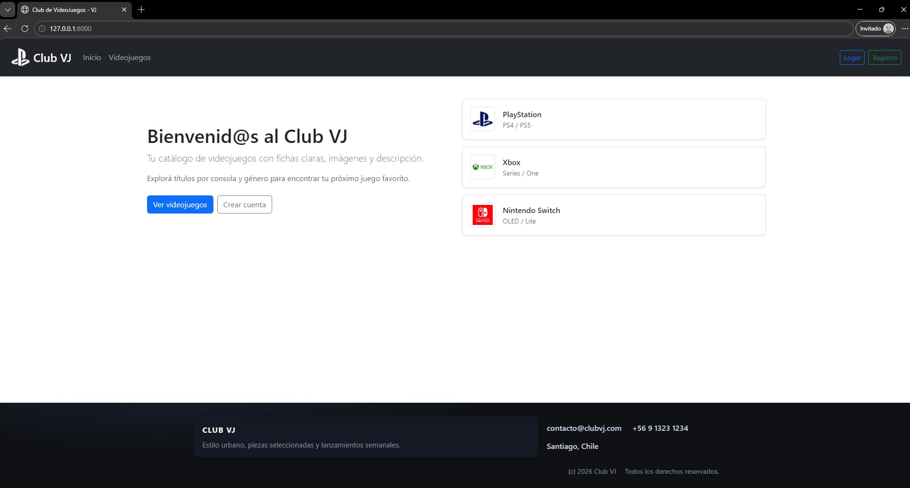
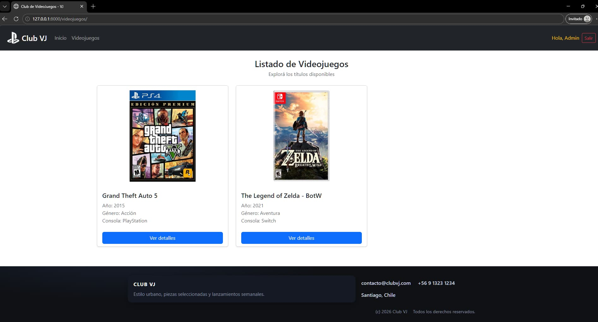
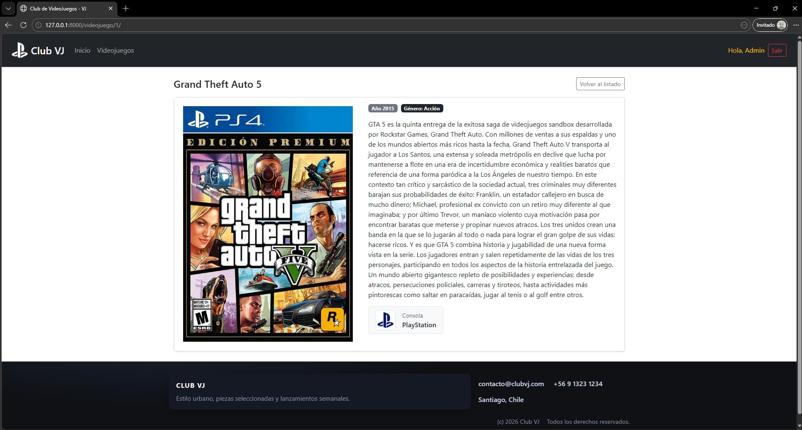
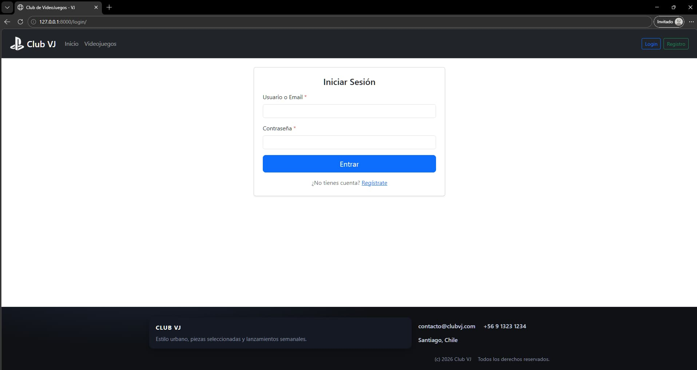
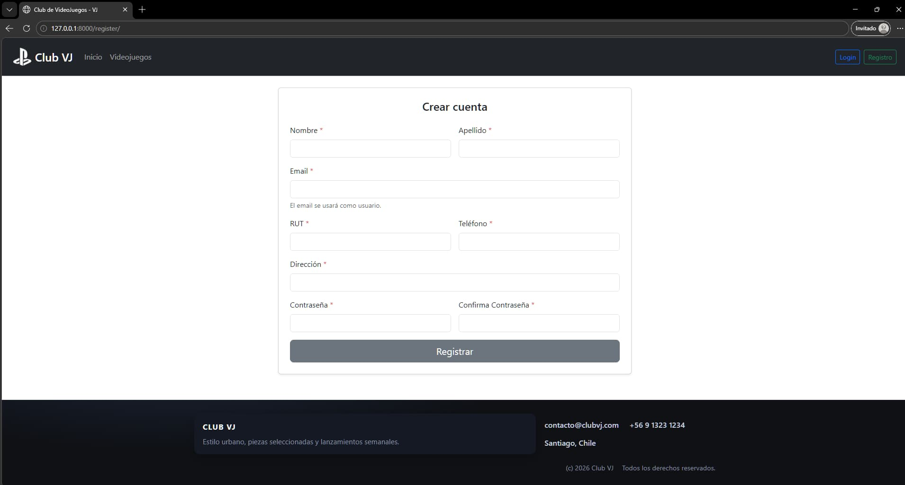
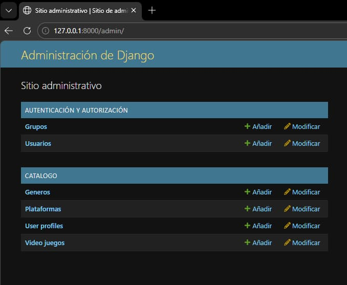

# Club VJ — Catálogo de Videojuegos

Demo (Render): `https://club-videosjuegos.onrender.com/`

Aplicación web construida con Django para explorar un catálogo de videojuegos, con registro/inicio de sesión y panel de administración.

## Stack

- **Backend:** Python 3, Django
- **Base de datos:** PostgreSQL (Neon) en producción / SQLite en desarrollo
- **Static files:** WhiteNoise (`collectstatic`)
- **UI:** Bootstrap 5, Font Awesome
- **Deploy:** Render + Neon (Postgres)

## Funcionalidades

- Home y navegación.
- Listado de videojuegos (público).
- Detalle de videojuego (requiere iniciar sesión).
- Registro, login y logout (Django Auth con sesiones).
- Panel `/admin` para administrar plataformas, géneros, videojuegos y perfiles.
- Lógica VIP (opcional): títulos del año **2026** visibles solo para usuarios con perfil VIP.

## Ejecutar en local

```bash
python -m venv .venv
# Activa el entorno virtual
pip install -r requirements.txt
python manage.py migrate
python manage.py createsuperuser
python manage.py runserver
```

## Variables de entorno (producción)

- `SECRET_KEY`: clave segura (obligatoria)
- `DEBUG`: `False`
- `ALLOWED_HOSTS`: opcional (por ejemplo `tu-servicio.onrender.com,tu-dominio.com`)
- `DATABASE_URL`: conexión PostgreSQL de Neon (con SSL)

> Nota: si `DATABASE_URL` no está definida, la app usa SQLite (`db.sqlite3`) para desarrollo.

## Deploy (Render + Neon)

1. Crea una base de datos PostgreSQL en Neon y copia el connection string (`DATABASE_URL`).
2. En Render, crea un **Web Service** (Python) apuntando a tu repo.
3. Configura:
   - **Build Command:** `bash build.sh`
   - **Start Command:** `gunicorn club_vj.wsgi:application --bind 0.0.0.0:$PORT`
4. Agrega las variables de entorno (`DATABASE_URL`, `SECRET_KEY`, `DEBUG=False`).
5. Valida endpoints principales (`/`, `/videojuegos/`, `/login/`, `/register/`, `/admin/`) y crea un admin si lo necesitas (`python manage.py createsuperuser`).

## Capturas







